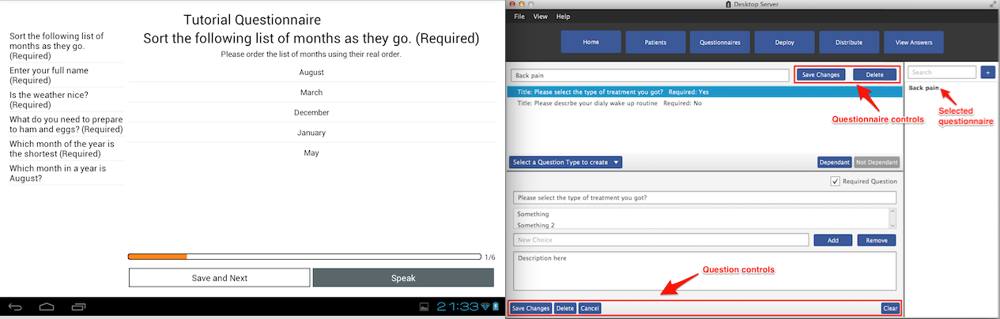
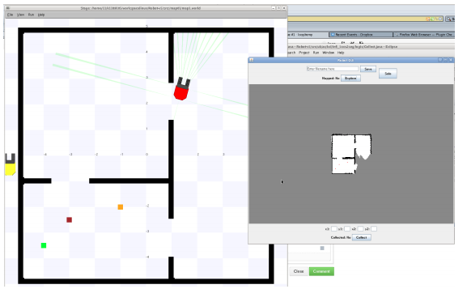

## Cloudit

### [Play Store](https://play.google.com/store/apps/details?id=io.invaders.android.cloudit)

One of the first CloudApp app for Android. 

## Medical Survey System

### [Source Code](https://github.com/loop/SurveySystem)

Java based desktop server with inter-app communication with Android application for designing and distributing surveys. Developed for Final Year University Dissertation

## Autonomous Garbage Collector Robot 

### [Source Code](https://github.com/loop/PlayerStage-Autonomous-Robot)

A prototype robot control software in Java that observes and acts upon a simulation environment. It contains implementations of various exploration, mapping and path planning algorithms.

### More...

You can find more projects I'm currently hacking together on [GitHub](https://github.com/loop).